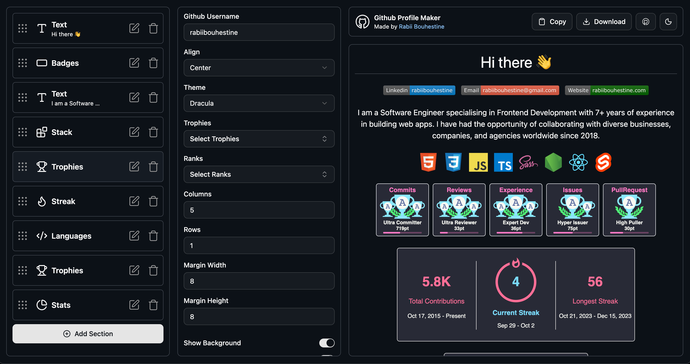

# GitHub Profile Maker

A minimal README maker that lets users easily generate a **GitHub profile README** using customizable sections.

Live demo: [github-profile-maker.netlify.app](https://github-profile-maker.netlify.app)



---

## Table of Contents

- [Features](#features)
- [Installation / Running Locally](#installation--running-locally)
- [Technologies Used](#technologies-used)
- [License](#license)

---

## Features

- Customizable sections (e.g. Text, Image, Badges, Trophies, Stats)
- Live preview of the README as you build it
- Download the generated Markdown file or Copy to clipboard
- Intuitive UI for users to build a profile README
- Lightweight and minimal dependencies

---

## Installation / Running Locally

1. Clone the repo:

```bash
git clone https://github.com/rabiibouhestine/github-profile-maker.git
cd github-profile-maker
```

2. Install dependencies:

```bash
npm install
# or
yarn install
```

3. Run in development mode:

```bash
npm run dev
# or
yarn dev
```

4. Open your browser at http://localhost:5173 (or as indicated) to use the tool.

## Technologies Used

- React (with TypeScript)
- Vite for bundling / dev server
- Tailwind CSS and shadcn for Styling
- [dndkit](https://dndkit.com/) for Drag and Drop
- [framer motion](https://motion.dev/) for Animations

## License

This project is licensed under the MIT License
